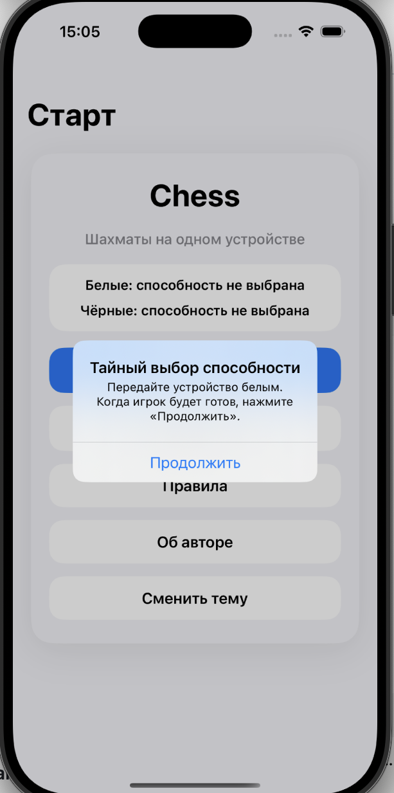
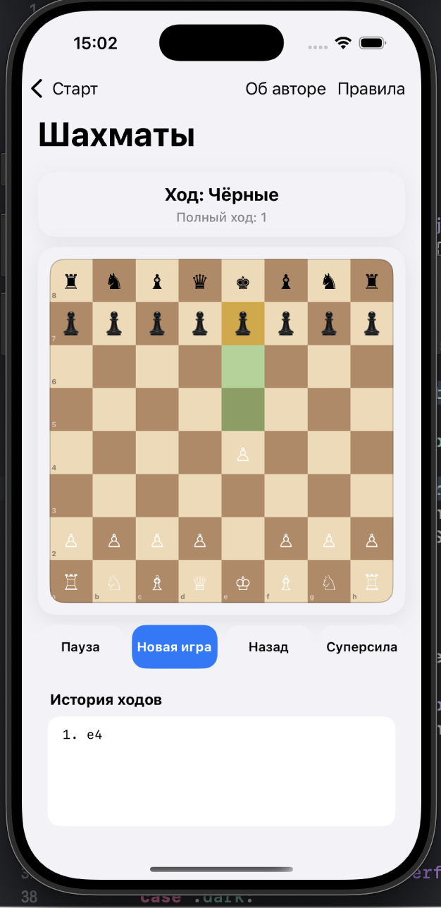
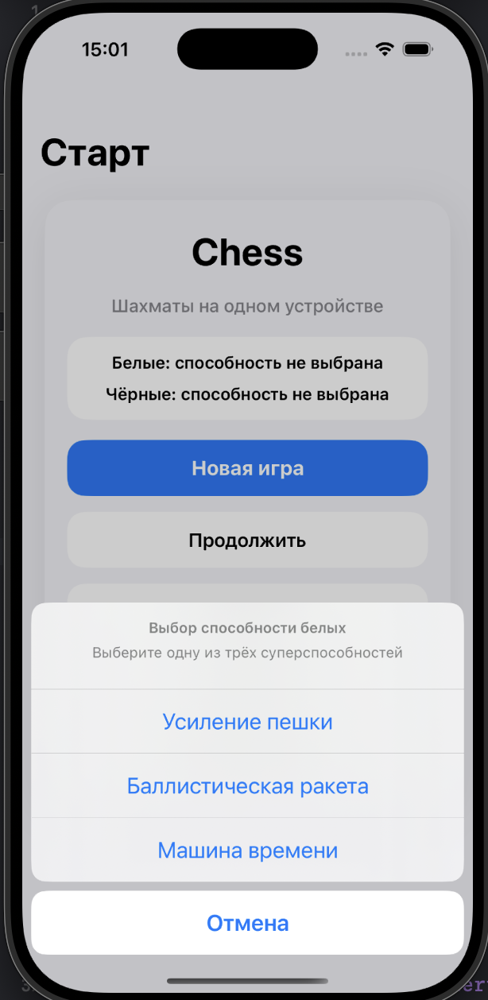
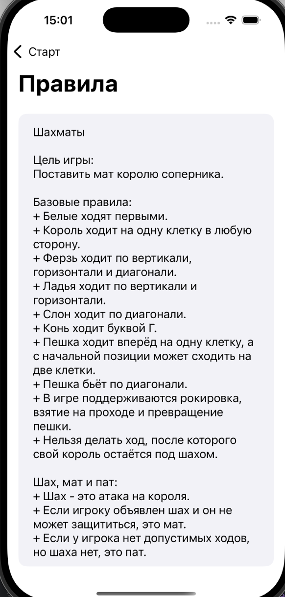

# Chess iOS

iOS-приложение для игры в шахматы на одном устройстве с поддержкой базовых шахматных правил, сохранения партии, истории ходов, смены темы и системы суперспособностей для игроков.

## О проекте

**Chess iOS** — это шахматное приложение, написанное на **Swift + UIKit**.  
Проект реализует партию для двух игроков на одном устройстве и включает шахматные механики и дополнительный игровой режим с суперспособностями.

Приложение позволяет:
- начать новую игру;
- продолжить сохранённую партию;
- просматривать историю ходов;
- выбирать суперспособности перед началом матча;
- ставить игру на паузу;
- автоматически сохранять состояние партии;
- переключать светлую и тёмную тему интерфейса.

---

## Скриншоты

### Стартовый экран


### Игровой экран


### Выбор суперспособности


### Экран правил


---

## Основные возможности

### Шахматная логика
- все основные фигуры и правила перемещения;
- проверка допустимости ходов;
- шах, мат и пат;
- рокировка;
- взятие на проходе;
- превращение пешки;
- история ходов с шахматной нотацией.

### Игровой интерфейс
- доска на `UICollectionView`;
- подсветка выбранной клетки;
- подсветка допустимых ходов;
- подсветка шаха;
- отображение текущего игрока и статуса партии;
- история ходов;
- кнопки паузы, новой игры, отката и использования способности.

### Суперспособности
Перед началом новой партии каждому игроку случайно предлагаются **3 способности**, из которых он **тайно выбирает 1**.

Реализованы:
- **Призыв фигуры** — можно призвать коня на пустую клетку своей половины доски;
- **Король как ферзь** — следующим ходом король двигается как ферзь;
- **Баллистическая ракета** — уничтожение фигуры соперника, кроме короля и ферзя;
- **Усиление пешки** — после 40-го полного хода пешка превращается в коня;
- **Машина времени** — открывает откат ходов.

### Сохранение партии
- сохранение состояния игры через `UserDefaults`;
- автоматическое сохранение при уходе приложения в фон;
- возможность продолжить сохранённую партию со стартового экрана.

### Дополнительно
- светлая и тёмная тема;
- отдельный экран с правилами;
- отдельный экран с информацией об авторе.

---

## Стек

- **Swift**
- **UIKit**
- **UICollectionView**
- **UserDefaults**
- **Codable**
- **UINavigationController**
- **Auto Layout**
- **Viper**
- кастомные UI-компоненты
- работа с состоянием приложения и сохранением данных

---

## Архитектура

Проект построен на модульном подходе с разделением ответственности между слоями:

- **View** — отвечает за отображение интерфейса и пользовательские действия;
- **Presenter** — связывает UI и бизнес-логику;
- **Interactor** — содержит игровую логику;
- **Router** — отвечает за навигацию между экранами.

В проекте выделены отдельные модули:
- `StartGame`
- `Game`
- `Rules`
- `Author`

---

## Структура проекта

```text
App
Core
Entities
Modules
Services
Resources
Extensions
